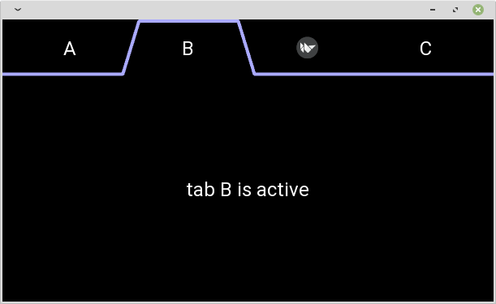
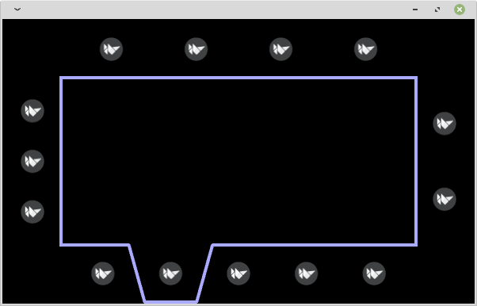

# KXTablikeLooksBehavior

Bored of `kivy.uix.tabbedpanel`'s design?
Try this instead.  
[Youtube](https://www.youtube.com/watch?v=jdaXuw-QGLo)  



## Installation

```
pip install git+https://github.com/gottadiveintopython/kivyx.uix.behavior.tablikelooks#egg=kivyx.uix.behavior.tablikelooks
```

## LICENSE

MIT

## Test Environment

- CPython 3.8.10 + Kivy2.0.0
